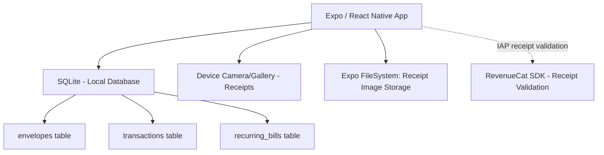

# PocketLedger Architecture

**Document:** ARCHITECTURE.md  
**Product:** PocketLedger (Budget App)  
**Publisher:** Heldig Lab  
**Price:** Free (5 Envelopes) / $19.99 Paid Upfront (Unlimited + Sync). No Subscriptions.  
**Source of Truth:** [SPEC.md](./SPEC.md)  

## Purpose

This document defines the architecture for PocketLedger. It covers:
- Expo / React Native app structure
- The Local SQLite Envelope Engine
- Zero-Bank Integration
- The Zero-Backend Reality

## Architectural Principles & Competitive Edge

- **Strictly No Backend:** Financial data is the most sensitive data. PocketLedger stores 100% of transactions in local SQLite. There is no Plaid integration, no server, and no cloud account.
- **Manual Input Optimization:** The UI bypasses standard keyboards for a custom numeric keypad, ensuring transaction entry takes < 3 seconds.
- **One Price Forever:** RevenueCat is used strictly for on-device receipt validation of a non-consumable $19.99 purchase. No recurring billing.

## System Context



> **Note:** RevenueCat is used solely for App Store / Play Store receipt validation. No financial data is transmitted. Premium status is cached locally for 25 hours for offline use.

## High-Level Component Model

### Client Layer

- **Zustand:** Global state for current month, envelope balances, and active entry mode (Income vs Expense).
- **SQLite (expo-sqlite):** The core ledger. Handles complex sum aggregations (e.g., `SUM(amount) WHERE envelope_id = X AND date >= Y`).
- **Expo FileSystem:** Stores compressed JPEG receipt images linked to transactions.

### The "No Backend" Reality
- Because there is no backend, cross-device sync is not automatic. Users must rely on iCloud/Google Drive backups, or the manual JSON Export/Import feature provided in the settings. This is a feature, not a bug, for extreme privacy.

## Data Model (SQLite)

#### `envelopes`
- `id`: UUID
- `name`: String (e.g., "Groceries")
- `icon`: String (Emoji or SVG ref)
- `budgeted_amount`: Decimal
- `color_hex`: String

#### `transactions`
- `id`: UUID
- `envelope_id`: UUID (Foreign Key)
- `amount`: Decimal (Negative for expense, Positive for income/refund)
- `date`: ISO Timestamp
- `note`: String
- `receipt_uri`: String (Path to local filesystem, optional)
- `is_cleared`: Boolean

#### `recurring_bills` (Premium)
- `id`: UUID
- `amount`: Decimal
- `name`: String
- `frequency`: String (Monthly, Weekly, Yearly)
- `next_due_date`: ISO Timestamp

### SQLite Schema

```sql
-- Enable Write-Ahead Logging for crash safety (NFR-302)
PRAGMA journal_mode = WAL;

-- Envelope definitions: each envelope represents a budget category
CREATE TABLE envelopes (
    id              TEXT PRIMARY KEY,                        -- UUID
    name            TEXT NOT NULL,                           -- e.g. "Groceries", "Rent"
    icon            TEXT,                                    -- emoji or SVG reference
    budgeted_amount REAL NOT NULL DEFAULT 0,                 -- monthly budget target
    color_hex       TEXT,                                    -- hex color for UI card
    sort_order      INTEGER NOT NULL DEFAULT 0,              -- user-defined display order
    created_at      TEXT NOT NULL DEFAULT (datetime('now'))  -- ISO-8601 timestamp
);

-- Every income/expense entry linked to one envelope
CREATE TABLE transactions (
    id              TEXT PRIMARY KEY,                        -- UUID
    envelope_id     TEXT NOT NULL REFERENCES envelopes(id) ON DELETE CASCADE,
    amount          REAL NOT NULL,                           -- negative = expense, positive = income/refund
    date            TEXT NOT NULL,                           -- ISO-8601 timestamp
    note            TEXT,                                    -- optional memo
    receipt_uri     TEXT,                                    -- Premium only: local filesystem path to receipt JPEG
    is_cleared      INTEGER NOT NULL DEFAULT 0,              -- 0/1 — reconciled with bank statement
    created_at      TEXT NOT NULL DEFAULT (datetime('now'))
);

-- Premium-only: auto-posting bills on a schedule
CREATE TABLE recurring_bills (
    id              TEXT PRIMARY KEY,                        -- UUID
    envelope_id     TEXT NOT NULL REFERENCES envelopes(id) ON DELETE CASCADE,
    amount          REAL NOT NULL,
    name            TEXT NOT NULL,                           -- e.g. "Netflix", "Electric Bill"
    frequency       TEXT NOT NULL CHECK (frequency IN ('weekly','monthly','yearly')),
    next_due_date   TEXT NOT NULL,                           -- ISO-8601 date of next auto-post
    is_active       INTEGER NOT NULL DEFAULT 1,              -- 0/1
    created_at      TEXT NOT NULL DEFAULT (datetime('now'))
);

-- Key-value store for app-wide preferences
CREATE TABLE settings (
    key             TEXT PRIMARY KEY,                        -- e.g. "currency_symbol", "first_day_of_week", "premium_unlocked"
    value           TEXT NOT NULL
);

-- Default settings inserted at first launch
INSERT OR IGNORE INTO settings (key, value) VALUES ('carry_over_enabled', '1');

-- Indexes
CREATE INDEX idx_transactions_envelope    ON transactions(envelope_id);
CREATE INDEX idx_transactions_date        ON transactions(date);            -- monthly SUM aggregations
CREATE INDEX idx_recurring_bills_envelope ON recurring_bills(envelope_id);
CREATE INDEX idx_recurring_bills_due      ON recurring_bills(next_due_date); -- scheduler lookup
```

### RevenueCat Integration

**SDK:** `react-native-purchases` (RevenueCat React Native SDK)
**Authentication:** Anonymous App User IDs (no account creation required)

#### Product Configuration

| Platform | Product ID | Type | Price |
|----------|-----------|------|-------|
| iOS | `pocketledger_premium` | Non-Consumable | $19.99 |
| Android | `pocketledger_premium` | Non-Consumable | $19.99 |

#### Entitlements

| Entitlement | Grants Access To |
|------------|-----------------|
| `premium` | Unlimited envelopes (free tier limited to 5), recurring transactions (subscriptions/bills), advanced charts/trends, receipt photo attachments on transactions |

#### Implementation Flow

1. **App Launch:** Initialize RevenueCat SDK with anonymous user ID. Check entitlement status from cache.
2. **Paywall Display:** Show paywall when user hits free-tier limit. Fetch offerings from RevenueCat (falls back to cached offerings if offline).
3. **Purchase:** Call `purchasePackage()`. RevenueCat handles receipt validation with Apple/Google servers.
4. **Verification:** On success, RevenueCat updates entitlement. App checks `customerInfo.entitlements.active['premium']`.
5. **Restore:** "Restore Purchases" button calls `restorePurchases()`. Essential for users reinstalling or switching devices.
6. **Offline Fallback:** RevenueCat caches entitlement status locally. Premium access persists offline after initial verification. Cache TTL: 25 hours (RevenueCat default). If cache expires while offline, maintain last-known premium status until next successful server check.

#### Error Handling

- **Purchase cancelled:** No action. Return to paywall.
- **Purchase failed:** Show "Purchase couldn't be completed. Please try again." Do not retry automatically.
- **Network error during restore:** Show "Couldn't reach the App Store. Check your connection and try again."
- **Receipt validation failed:** Log error. Show generic "Something went wrong" message. Do not grant premium.

## The Envelope Engine
The engine calculates available balances dynamically:

```sql
-- Expenses are stored as negative, income/refunds as positive
spent_this_month = SUM(amount) FROM transactions WHERE envelope_id = ? AND date >= start_of_month
available = budgeted_amount + spent_this_month + carry_over_from_prior_month
```

1. `budgeted_amount` (from `envelopes` table)
2. `spent_this_month` = `SELECT SUM(amount) FROM transactions WHERE envelope_id = ? AND date >= start_of_month` -- includes both expenses (negative) and income/refunds (positive)
3. `carry_over_from_prior_month` = prior month's `available` balance (0 if carry-over is disabled)
4. `available` = `budgeted_amount + spent_this_month + carry_over_from_prior_month`

### Month Rollover Logic

At each month boundary the Envelope Engine checks the `carry_over_enabled` setting (from the `settings` table, default `1`):

- **If `carry_over_enabled = 1` (default):** `available = budgeted_amount + spent_this_month + prior_month_remaining`. Unspent money rolls forward; overspent deficits also carry forward as negative carry-over.
- **If `carry_over_enabled = 0`:** `available = budgeted_amount + spent_this_month`. Balances reset cleanly to the budgeted amount at the start of each month.

The Envelope Engine SQL scopes transactions using `start_of_month` (derived from the current date and the user's configured `first_day_of_week` / first-of-month preference) to ensure only the current period's transactions are summed.

### Premium Enforcement

All premium-gated features must be validated before the operation proceeds. The app checks `customerInfo.entitlements.active['premium']` (cached locally by RevenueCat for up to 25 hours).

| Feature | Enforcement Point |
|---|---|
| **6+ Envelopes** | Block envelope creation when `COUNT(envelopes) >= 5` and premium is not active. Show paywall. |
| **Receipt Photos** | UI must not open the camera/photo picker for free-tier users. The `receipt_uri` field in `transactions` must remain NULL for non-premium users. Import validation must strip `receipt_uri` values for free-tier users. |
| **Recurring Bills** | All CRUD operations on `recurring_bills` must check premium entitlement before proceeding. Import validation must strip `recurring_bills` entries for free-tier users. |
| **Advanced Charts/Trends** | Block navigation to the Trends screen for free-tier users. Show paywall. |